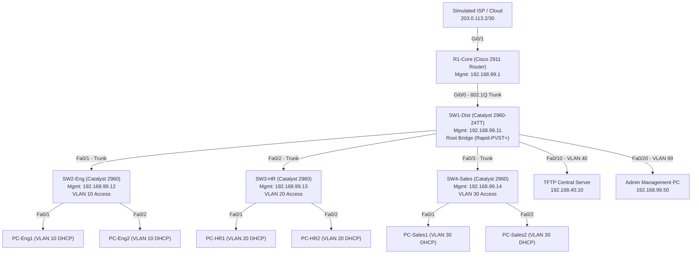

# Milestone 02: Network Design Completion

**Scheduled Date:** 30-09-2026  
**Status:** `COMPLETED & DELIVERED`  
**Deliverable Focus:** Network Topology Diagram, IP Addressing / VLSM Table, Hardware Device Inventory, and Cabling Matrix  

---

## 1. Network Topology Architecture

The network adopts a **Three-Tier Hierarchical Campus Architecture** (Core, Distribution, and Access):

Full ASCII topology diagram available at: [packet_tracer/topology_diagram.txt](file:///mnt/win-newvol/Projects/GitHub/comp-network-ia3/packet_tracer/topology_diagram.txt)

---

## 2. Hardware Device Inventory & Specification List

| Hostname | Role | Device Model | Management IP | Subnet Mask | Default Gateway | Physical Location |
| :--- | :--- | :--- | :--- | :--- | :--- | :--- |
| **R1-Core** | Core Router (ROAS) | Cisco 2911 | `192.168.99.1` | `255.255.255.0` | N/A | HQ Server Room Rack-01 |
| **SW1-Dist** | Distribution Switch | Cisco Catalyst 2960-24TT | `192.168.99.11` | `255.255.255.0` | `192.168.99.1` | HQ Server Room Rack-02 |
| **SW2-Eng** | Access Switch | Cisco Catalyst 2960-24TT | `192.168.99.12` | `255.255.255.0` | `192.168.99.1` | Engineering Lab IDF-01 |
| **SW3-HR** | Access Switch | Cisco Catalyst 2960-24TT | `192.168.99.13` | `255.255.255.0` | `192.168.99.1` | HR Wing IDF-02 |
| **SW4-Sales**| Access Switch | Cisco Catalyst 2960-24TT | `192.168.99.14` | `255.255.255.0` | `192.168.99.1` | Sales Wing IDF-03 |
| **TFTP-Server**| Central Archival | Generic Server-PT | `192.168.40.10` | `255.255.255.0` | `192.168.40.1` | HQ Data Center |
| **Admin-PC** | Management Workstation | Generic PC-PT | `192.168.99.50` | `255.255.255.0` | `192.168.99.1` | Network Operations Center |

Structured inventory data file: [data/inventory.csv](file:///mnt/win-newvol/Projects/GitHub/comp-network-ia3/data/inventory.csv)

---

## 3. Variable Length Subnet Masking (VLSM) Table

Base Network: `192.168.0.0/16`

| VLAN ID | Subnet Name | Network Address | Subnet Mask | CIDR | Usable Range | Broadcast | Default Gateway | DHCP Pool Scope |
| :---: | :--- | :--- | :--- | :---: | :--- | :--- | :--- | :--- |
| **10** | Engineering | `192.168.10.0` | `255.255.255.0` | `/24` | `192.168.10.1` - `.254` | `192.168.10.255` | `192.168.10.1` | `.10 - .254` (POOL_ENG) |
| **20** | Human Resources | `192.168.20.0` | `255.255.255.0` | `/24` | `192.168.20.1` - `.254` | `192.168.20.255` | `192.168.20.1` | `.10 - .254` (POOL_HR) |
| **30** | Sales & Mktg | `192.168.30.0` | `255.255.255.0` | `/24` | `192.168.30.1` - `.254` | `192.168.30.255` | `192.168.30.1` | `.10 - .254` (POOL_SALES) |
| **40** | Server Farm | `192.168.40.0` | `255.255.255.0` | `/24` | `192.168.40.1` - `.254` | `192.168.40.255` | `192.168.40.1` | Static (`.10` TFTP Server) |
| **99** | Management | `192.168.99.0` | `255.255.255.0` | `/24` | `192.168.99.1` - `.254` | `192.168.99.255` | `192.168.99.1` | Static (SVIs & Admin PC) |
| **999**| Parking Lot | `N/A` | `N/A` | `N/A` | Security Isolation | `N/A` | None | Unrouted Blackhole |

Structured VLANs data file: [data/vlans.csv](file:///mnt/win-newvol/Projects/GitHub/comp-network-ia3/data/vlans.csv)

---

## 4. Port Interconnection & Cabling Matrix

| Source Device | Source Port | Target Device | Target Port | Cable Type | Operational Mode |
| :--- | :--- | :--- | :--- | :--- | :--- |
| `R1-Core` | GigabitEthernet 0/0 | `SW1-Dist` | GigabitEthernet 0/1 | Copper Straight-Through | 802.1Q Trunk (Native 999) |
| `SW1-Dist` | FastEthernet 0/1 | `SW2-Eng` | FastEthernet 0/24 | Copper Straight-Through | 802.1Q Trunk (Native 999) |
| `SW1-Dist` | FastEthernet 0/2 | `SW3-HR` | FastEthernet 0/24 | Copper Straight-Through | 802.1Q Trunk (Native 999) |
| `SW1-Dist` | FastEthernet 0/3 | `SW4-Sales` | FastEthernet 0/24 | Copper Straight-Through | 802.1Q Trunk (Native 999) |
| `SW1-Dist` | FastEthernet 0/10 | `TFTP-Server` | FastEthernet 0 | Copper Straight-Through | Access Port (VLAN 40) |
| `SW1-Dist` | FastEthernet 0/20 | `Admin-PC` | FastEthernet 0 | Copper Straight-Through | Access Port (VLAN 99) |
| `SW2-Eng` | FastEthernet 0/1 | `PC-Eng1` | FastEthernet 0 | Copper Straight-Through | Access Port (VLAN 10) |
| `SW2-Eng` | FastEthernet 0/2 | `PC-Eng2` | FastEthernet 0 | Copper Straight-Through | Access Port (VLAN 10) |
| `SW3-HR` | FastEthernet 0/1 | `PC-HR1` | FastEthernet 0 | Copper Straight-Through | Access Port (VLAN 20) |
| `SW3-HR` | FastEthernet 0/2 | `PC-HR2` | FastEthernet 0 | Copper Straight-Through | Access Port (VLAN 20) |
| `SW4-Sales` | FastEthernet 0/1 | `PC-Sales1` | FastEthernet 0 | Copper Straight-Through | Access Port (VLAN 30) |
| `SW4-Sales` | FastEthernet 0/2 | `PC-Sales2` | FastEthernet 0 | Copper Straight-Through | Access Port (VLAN 30) |

Structured interfaces data file: [data/interfaces.csv](file:///mnt/win-newvol/Projects/GitHub/comp-network-ia3/data/interfaces.csv)

---

## 5. Review Checklist for Milestone 02
- [x] Hierarchical topology finalized and validated against enterprise best practices.
- [x] Complete VLSM addressing table designed with non-overlapping subnets.
- [x] Full device list and port allocation matrix documented.
- [x] CSV data models structured for Python Jinja2 rendering.
